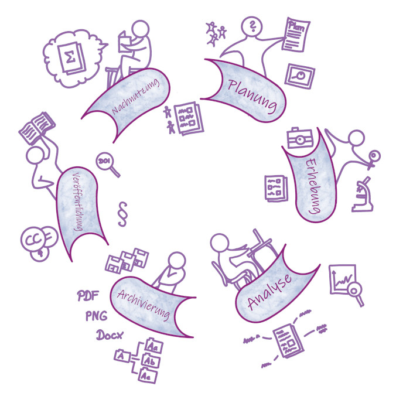

<!--

author:   Britta Petersen
email:    b.petersen@rz.uni-kiel.de
version:  0.1.0
language: de
narrator: DE German Female

link: https://raw.githubusercontent.com/RDM4CAU/Intro-to-RDM/refs/heads/main/cau-style.css

icon:     images/Logo_cau-norm-de-lilagrey-rgb-0720_2022.png

comment:  Einführung in das Thema Forschungsdatenmanagement im Rahmen der [LV158_UeDaten: Archäologische Datenmodellierung, Datenerfassung und Forschungsdatenmanagement](https://lms.uni-kiel.de/auth/RepositoryEntry/5689081969/Infos/0)

-->

# Forschungsdatenmanagement

<center>

<!-- style="width: 40%" -->

</center>

>**Britta Petersen** - [Zentrales Forschungsdatenmanagement](https://www.fdm.uni-kiel.de/de)

<div style="page-break-after: always;"></div>

# Disclaimer

>TinyURL zu dieser Präsentation: [https://tinyurl.com//S02-FDM](https://tinyurl.com/S02-FDM)

>**Disclaimer**: Please note that you are leaving the CAU pages once you open this presentation in your browser. This presentation includes links to other third party websites and services. When you click on these links you will leave this presentation and will be redirected to the respective another sites. These sites are not under our control.
>
>RDM@CAU is not responsible for the content of linked third party websites. Please be aware that the security and privacy policies on these sites may be different than CAU policies, so please read third party privacy and security policies closely.
>
> If you need help, feel free to ask:
>
> [b.petersen@rz.uni-kiel.de](mailto:b.petersen@rz.uni-kiel.de)
>
> ____________________________________________
>
>  This work is licensed under a [Creative Commons Attribution 4.0 International License](https://creativecommons.org/) with exception of the used material from other copyright holders.

<div style="page-break-after: always;"></div>

# Forschungsdaten...? 🧪

{{0-1}}
********************************************************************************

<!-- style="font-size: 30px;" -->
>**Lassen Sie uns kurz gemeinsam sammeln!**
>
>Was sind Forschungsdaten?
>
>**Nennen Sie so viele Beispiele für Forschungsdaten, wie möglich!**
>
>https://answergarden.ch/5067835

********************************************************************************

{{1-2}}
********************************************************************************

<iframe src="https://answergarden.ch/5067835" style="border:0px;width:100%;height:500px" allowfullscreen="true" webkitallowfullscreen="true" mozallowfullscreen="true"></iframe>

<div style="page-break-after: always;"></div>

********************************************************************************

{{2-3}}
********************************************************************************
<!-- style="font-size: 25px;" -->
Die DFG schreibt hierzu:

> „Zu Forschungsdaten zählen u. a. Messdaten, Laborwerte, audiovisuelle Informationen, Texte, Surveydaten oder Beobachtungsdaten, methodische Testverfahren sowie Fragebögen. Korpora und Simulationen können ebenfalls zentrale Ergebnisse wissenschaftlicher Forschung darstellen und werden daher ebenfalls unter den Begriff Forschungsdaten gefasst. Da Forschungsdaten in einigen Fachbereichen auf der Analyse von Objekten basieren (z. B. Gewebe-, Material-, Gesteins-, Wasser- und Bodenproben, Prüfkörper, Installationen, Artefakte und Kunstgegenstände), muss der Umgang mit diesen ebenso sorgfältig sein und eine fachlich adäquate Nachnutzungsmöglichkeit, wann immer sinnvoll und möglich, mitgedacht werden. Ähnliches gilt, wenn Software für die Entstehung oder Verarbeitung von Forschungsdaten erforderlich ist.“
>
> (**DFG 2021**)

********************************************************************************

{{3-4}}
********************************************************************************
<!-- style="font-size: 25px;" -->
Etwas weniger kompliziert definierte das PrePARe Projekt der Camebridge University den Begriff Forschungsadaten:

<!-- style="font-size: 25px;" -->
> “Any any information you use in your research.”
>
> (**University of Camebridge PrePARe Project**)

********************************************************************************

{{4}}
********************************************************************************

 <!-- width="350px" align="right" -->

<!-- style="font-size: 25px;" -->
**Beispiele für Forschungsdaten**:

- Audio- und Videoaufzeichnungen
- Tagebücher
- Daten aus geografischen Informationssystemen (GIS)
- Labor- und Feldnotizen
- Modell-, Skript- und Forschungssoftwarecode
- Bilder und Abbildungen
- Fragebögen und Codebücher
- Proben und Artefakte
- Sensor-Daten
- Sequenzierdaten
- Spektren
- Text- und Tabellenkalkulationsdokumente
- Textkorpora und Annotationen
- Topographie-Daten
- Abschriften

********************************************************************************

<div style="page-break-after: always;"></div>

# Forschungsdatenmanagement...? 🤹

{{0-1}}
********************************************************************************

<!-- style="font-size: 30px;" -->
> Forschungsdatenmanagement (FDM) umfasst alle Prozesse der **Transformation**, **Selektion** und **Speicherung** von Forschungsdaten mit dem gemeinsamen **Ziel**, diese *~~langfristig~~* und *~~personenunabhängig~~* **zugänglich**, **nachnutzbar** und **nachprüfbar** zu halten.
>
>www.forschungsdaten.info


********************************************************************************

{{1}}
********************************************************************************

Zentrale Aspekte des FDM
---

- **Datenorganisation**

  - Strukturierung und Dokumentation der Daten

- **Datenqualität und -integrität**

  - Sicherstellung, dass die Daten korrekt, vollständig und zuverlässig sind.

- **Datensicherheit**

  - Schutz vor Datenverlusten
  - Schutz von sensiblen Daten

- **Datenarchivierung**

  - Langfristige Speicherung und Zugänglichmachung von Daten.

- **Datenzugang und -verfügbarkeit**

  - Sicherstellung, dass Daten zugänglich sind

- **Datenethik und -recht**

  - Einhaltung gesetzlicher Bestimmungen, Datenschutzvorgaben und ethischer Richtlinien beim Umgang mit Forschungsdaten.

********************************************************************************

<div style="page-break-after: always;"></div>

# Leitprinzipien: FAIR 🎯

{{0-1}}
********************************************************************************

<!-- style="max-width: 50%; float:left; font-size: 25px" -->
>Die **FAIR-Prinzipien** dienen als Leitprinzipien und Orientierungshilfe zur Erreichung des Ziels: ***~~Daten langfristig und personenunabhängig zugänglich, nachnutzbar und nachprüfbar zu halten.~~***

<!-- style="max-width: 50%; float:right" -->
.")

********************************************************************************

{{1-2}}
********************************************************************************
<!-- style="font-size: 30px;" -->
>**F - ❔**
<!-- style="font-size: 30px;" -->
>**A - ❔**
<!-- style="font-size: 30px;" -->
>**I - ❔**
<!-- style="font-size: 30px;" -->
>**R - ❔**

********************************************************************************

{{2-10}}
<!-- style="font-size: 30px;" -->
>**F**indable

{{6-7}}
****************
<!-- style="font-size: 30px;" -->
Daten sollen so strukturiert und beschrieben werden, dass sie leicht auffindbar sind.

Dazu gehört die Verwendung eindeutiger Dateinamen, digitaler Identifier (z. B. DOI, ORCID) und eine klare, vollständige Dokumentation (Metadaten).

Metadaten und Daten sollten sowohl für Menschen als auch für Computer leicht zu finden sein.

Maschinenlesbare Metadaten sind für das automatische Auffinden von Datensätzen und Diensten unerlässlich und daher ein wesentlicher Bestandteil FAIRer Daten.

***************

{{3-10}}
<!-- style="font-size: 30px;" -->
>**A**ccessible

{{7-8}}
***********************

<!-- style="font-size: 30px;" -->
Daten sollen unter klar definierten Bedingungen zugänglich sein.

Sie sollten möglichst so zugänglich gemacht werden, dass sie auch langfristig, unabhängig von einer ursprünglichen Forschungsgruppe oder eines/einer einzelnen Forschenden, abgerufen werden können.

Wenn Daten nicht zugänglich gemacht werden können (z. B. aufgrund Sensibilität), sollten minstestens Metadaten zugänglich sein.
******************

{{4-10}}
<!-- style="font-size: 30px;" -->
>**I**nteroperable

{{8-9}}
**********************
<!-- style="font-size: 30px;" -->
Daten sollen in einer Form vorliegen, die es ermöglicht, sie mit anderen Datensätzen oder Softwaretools zu kombinieren, zu speichern und auszuwerten.

Dies erfordert die Verwendung von offenen Standards und Formaten, die eine Tool-unabhängige Nutzung und Weiterverarbeitung ermöglichen.

**********************

{{5-10}}
<!-- style="font-size: 30px;" -->
>**R**eusable

{{9-10}}
***************
<!-- style="font-size: 30px;" -->
Das Ziel der FAIR-Prinzipien ist es, die Wiederverwendung von Daten zu optimieren. 

Um dies zu erreichen, sollen Daten so aufbereitet werden, dass sie von anderen Forschenden nachvollzogen und für neue Forschungsfragen genutzt werden können.

Dies bedeutet, dass sie Hinweise für eine rechtssichere Nutzung beinhalten (Lizenzangaben) und eine Dokumentation die nötigen Informationen bereitstellt, um die Daten korrekt interpretieren zu können.

**************

{{10}}
***************
><!-- style="font-size: 30px;" -->
>*** Das Original finden Sie hier: [The FAIR Guiding Principles for scientific data management and stewardship](https://www.nature.com/articles/sdata201618).***

***************

<div style="page-break-after: always;"></div>

# Forschungsdatenlebenszyklus ♻️

{{0-1}}
************
Ein weiteres wichtiges Orientierungswerkzeug ist der Forschungsdatenlebenszyklus.

<center>

</center>

************

<div style="page-break-after: always;"></div>

{{1-2}}
********************************************************************************
 <!-- width="250px" align="right" -->

Planung
---

**Findable**

- Wie benenne ich Dateien, damit sie im Projektverlauf möglichst gut zu finden sind?
- Wie möchte ich die Daten nach Projektende auffindbar zu machen?
- ...

**Accessible**:

- Welche Speicherorte werden verwendet? Fallen Kosten an?
- Wer soll mit welchen Rechten Zugang zu den Daten haben?
- ...

**Interoperable**:

- Existieren Standards?
- Mit welchen Dateiformaten und Tools soll gearbeitet werden?
- In welchen Dateiformaten soll veröffentlicht werden?
- ...

**Reusable**:

- Sind Provinienzen klar?
- Sind Absprachen oder Vereinbarung bzgl. zukünftiger Nutzungsrechte zu treffen?

********************************************************************************

<div style="page-break-after: always;"></div>

{{2-3}}
********************************************************************************
 <!-- width="250px" align="right" -->

Erhebung und Analyse
---

**Findable**

- Welche Maßnahmen ergreife ich, um Verzeichnisse und Dateibenennungen konsistent zu halten?
- Wie mache ich verschiedene Arbeitsstände sichtbar?

**Accessible**

- Wie organisiere ich Zugriffsrechte- und Nutzungsverwaltung?

**Interoperabel**

- Sind Maßnahmen erforderlich, um eine Interoperabilität mit anderen Datensätzen oder Tools zu gewährleisten?

**Reusable**

- Welche Ansätze werden verfolgt, um die Daten kontinuierlich nachvollziehbar zu dokumentieren?
- Welche Maßnahmen werden getroffen, um eine hohe Qualität der Daten zu gewährleisten?

********************************************************************************
---

<div style="page-break-after: always;"></div>

{{3-4}}
********************************************************************************

 <!-- width="250px" align="right" -->

Archivierung & Veröffentlichung
---

**Findable**

- Welche Metadaten können die Daten gut auffindbar machen?
- Welche Infrastruktur ist für die Daten geeignet (z. B. eine generische vs. eine fachspezifische)

**Accessible**

- Wie sollen die Daten zugänglich sein? Ist ein Schutz norwendig?

**Interoperabel**

- Existieren (fachliche) Normen, Standards oder Empfehlungen für Daten oder Metadaten, die berücksichtigt werden sollten?
- In welchen Dateiformaten veröffentliche ich?

**Reusable**

* Welche Daten eigenen sich für die Nachnutzung?
* Unter welchen Lizenzbedingungen sollen die Daten veröffentlicht werden?

---
********************************************************************************

<div style="page-break-after: always;"></div>

{{4-5}}
********************************************************************************

 <!-- width="250px" align="right" -->

Nachnutzung
---

**Findable**

- Welche Metadaten sind mindestens nötig, um ein Auffinden möglich zu machen?

**Accessible**

- Wie lange werden die Daten für zukünftige Forscher:innen zugänglich bleiben (z. B. durch geeignete Infrastruktur)?
- Ab wann werden die Daten für zukünftige Forscher:innen zugänglich sein?

**Interoperabel**

- Werden die Daten in einem Dateiformat gespeichert, das eine langfristige Tool-unabhängige Nutzung ermöglicht?

**Reusable**

- Welche ethischen und rechtlichen Bedingungen sind an eine Nachnutzung geknüpft?

********************************************************************************

<div style="page-break-after: always;"></div>

# FDM & GWP  🧚

{{1}}
********************************************************************************
"Gute Wissenschaftliche Praxis oder Wissenschaftliche Integrität...
---

>...bildet die Grundlage einer vertrauenswürdigen Wissenschaft. Sie ist eine Ausprägung **wissenschaftlicher Selbstverpflichtung**, die den **respektvollen Umgang** miteinander, mit Studienteilnehmerinnen und -teilnehmern, Tieren, Kulturgütern und der Umwelt umfasst und das unerlässliche **Vertrauen der Gesellschaft in Wissenschaft** stärkt und fördert. (...) Die Wissenschaft selbst gewährleistet durch **redliches Denken** und **Handeln**, nicht zuletzt auch durch **organisations- und verfahrensrechtliche Regelungen**, gute wissenschaftliche Praxis."
>
> [*Leitlinien zur Sicherung guter wissenschaftlicher Praxis, DFG 2019*](https://zenodo.org/records/14281892), [*Verfahrensordnung zum Umgang mit wissenschaftlichem Fehlverhalten (VerfOwF), DFG 2024*](https://www.dfg.de/resource/blob/168578/caf3d827f4a743b6d23d14b79c90bfc6/dfg-80-01-v0819-de-data.pdf)

********************************************************************************

{{1-4}}
********************************************************************************

Gute Wissenschaftliche Praxis...
---

> ...betrifft:
>
> * redliches Denken und Handeln Einzelner sowie
> * organisations- und verfahrensrechtliche Regelungen

********************************************************************************

{{2-4}}
********************************************************************************
> ...sorgt für:
>
> * Vertrauenswürdigkeit der Wissenschaft
> * Vertrauen der Gesellschaft in Wissenschaft

********************************************************************************

{{3-4}}
********************************************************************************
> ...verlangt die Selbstverpflichtung zu respektvollem Umgang mit:
>
> * Studienteilnehmer:innen
> * Tieren
> * Kulturgütern und Umwelt
********************************************************************************

{{4}}
********************************************************************************
> <!-- width="150px" align="right" -->
>
>**Kleiner Rechercheauftrag:**
>
>Die DFG gibt Leitlinien zur Guten wissenschaftlichen Praxis vor.
>
>Diese finden Sie hier: https://wissenschaftliche-integritaet.de/kodex/
>
>Eine Organisation, die Fördermittel der DFG einwerben möchte, muss die DFG Leitlinien verpflichtend in eigenen institutionellen Leitlinien umsetzen.
>
>- **Existieren CAU solche Leitlinien zur Guten Wissenschaftlichen Praxis?**
>
>- Gutes Forschungsdatenmanagement gilt als ein Teil **~~guter wissenschaftlicher Praxis~~ (GWP)**. Welche Bezüge sehen Sie?

*************************************

<div style="page-break-after: always;"></div>

## Open Science

{{0-2}}
****************************************************
Open Science umfasst die unterschiedlichsten Aspekte der Wissenschaft:

****************************************************

{{1-2}}
****************************************************


(CC-BY 4.0, UNESCO)

****************************************************

{{2-3}}
****************************************************

Open Science verfolgt ähnliche Ziele, wie die FAIR-Prinzipien!


****************************

{{3-4}}
***********************
>Unter dem Begriff Open Science versteht man Strategien und Verfahren, die darauf abzielen, **alle Bestandteile des wissenschaftlichen Prozesses** über das Internet ***offen zugänglich***, ***nachvollziehbar*** und ***nachnutzbar*** zu machen.
>
>Open Science basiert auf vier Grundprinzipien:
>
>* <p style="color:#9a047f">Transparenz</p>
>
>* <p style="color:#9a047f">Reproduzierbarkeit</p>
>
>* <p style="color:#9a047f">Wiederverwendbarkeit</p>
>
>* <p style="color:#9a047f">Offenheit</p>
>
>(vgl. z. B. https://ag-openscience.de/open-science/)

****************************************************

{{4}}
********************************************************************************

<!-- style="font-size: 30px;" -->
>Ist FAIR = Open?

************************************

# How to start? 🕺

<div style="text-align:center">
><p style="color:#9a047f">**Es mag banal erscheinen, aber eine strukturierte Ordner- und Dateibenennung ist ein wichtiger erster Schritt im Forschungsdatenmanagement!**</p>
</div>

<center></center>

<div style="text-align:center">
<P><SMALL>https://xkcd.com/1459. Shared under CC-BY-NC License</SMALL></P>
</div>

<div style="page-break-after: always;"></div>

## Ordnerstruktur

<!-- style="width: 15%; float:right" -->


{{1-2}}
*************************

<!-- style="font-size: 20px;" -->
Es sollte eine logische Struktur mit klaren Hauptkategorien für Dateiordner angelegt werden, wie z. B.:

<br>

<!-- style="width: 50%; float:left" -->
``` ascii
Projekt XYZ
     |
     ├── Administration (Zeitpläne, Finanzdokumente)
     │   
     ├── Dokumente (Feldberichte, Protokolle)
     │
     ├── Daten (Erhobenen und verarbeitete Daten)
     │   
     ├── Ergebnisse (Auswertungen, Diagramme)
     │    
     ├── Literatur (Fachartikel, Bücher, Zitationen )
     │   
     └── README.txt
```
*************************

{{2-3}}
*************************

Weitere Unterordner können nach Bedarf angelegt werden.

=> Es sollten möglichst nicht mehr als drei Ordnerebenen angelegt werden.

<br>

<!-- style="width: 50%; float:left" -->
``` ascii
Projekt XYZ
     :
     │   
     ├── Daten
     │   └──── Rohdaten
     │   └──── Analysedaten 
     │   └──── Publikationsdaten      
     │
     ├── Ergebnisse
     │   └──── Auswertungen
     │   └──── Diagramme
     :
     │  
     └── README.txt
```
*************************

## Dateibenennung
{{0-1}}
*************************
**Systematische Dateibenennung entwickeln!**

Verwendung von klaren, konsistenten Namen für Dateien:

- Dateinamen kurz, aber präzise

- Einheitliches Muster für die Namensbestandteile der Dateinamen nutzen, z. B.

  - <Projektname>-<Versuch>-<Erhebungsdatum>-<Version>.suffix -> „ProjektXYZ-CO2Messung-20250120-v01.csv“

- Für Daten und Zeiten [***ISO 8601***](https://en.wikipedia.org/wiki/ISO_8601) nutzen

  - Datum und Uhrzeit, z.B. JJJJMMTThhmmss±hhmm

  - Datum, z. B. JJJJ-MM-TT

- Bei Nummerierungen führende Nullen verwenden (z. B. Fund-001, Fund-002, ...)

- Leerzeichen und sämtliche Sonderzeichen inklusive Umlaute grundsätzlich vermeiden "🦄"

  - einzig erlaubte Sonderzeichen sind Unterstrich (_) und Bindestrich (-)

  - Groß- und Kleinschreibung konsistent beibehalten!

*************************

{{1}}
*************************

- **Versionen?**

  - Grundsätzlich unspezifische Namensanhänge, wie \_final, \_fertig, \_inArbeit u. ä. vermeiden

  - besser mit v01, v02, ... v1-1, v1-2 oder mit Datumsangaben versionen kenntlich machen.

  - Regeln für Versionsschritte definieren und dokumentieren.

*************************

{{2}}
*************************

- **Dokumentation** von Struktur, Benennungsscheme und Regeln in einer README-Datei

  - Ordnerstruktur
  
  - Benennungskonventionen mit
  
    - Namensbestandteilen
    - Regeln
    - verwendeten Abkürzungen
    - Versionierungsschema

*************************

<div style="page-break-after: always;"></div>

### Beispiele

{{0-1}}
************************************************************

**Beispiel Ordnerstruktur**
---

<center>
  
    <sub style="text-align: right;">Provided by Oliver Nakoinz</sub>
</center>

********************************************************************************

{{1-2}}
****************************************

<!-- style="font-size: 30px;" -->
| Schlecht                | Besser                                               |
| ----------------------- | ---------------------------------------------------- |
| Grabung.jpg             | 2024-08-15\_Grabung\_Paderborn\_Schnitt3\_Foto01.jpg |
| Fundliste\_neu2.xlsx    | 2024-10-27\_Fundliste\_Paderborn\_v03.xlsx           |
| Befunde-NEU-korrekt.csv | 2024-09-27\_Befunde\_Paderborn\_v03.csv              |

**********************************

{{2-3}}
****************************************

<!-- style="font-size: 30px;" -->
**Beispiel für eine Benennungskonvention:**

<!-- style="font-size: 30px;" -->
><Project name>\_<Approach>\_<Location>\_<Person-ID_Date>.<Format-Suffix>
>
>Rebel-Hunting\_Interview\_DS-1-Orbital-Battle-Station\_Organa\_2001-05-12.mp4
****************************************

{{3}}
****************************************

<!-- style="font-size: 30px;" -->
Datum nicht nach ISO 8601. ACHTUNG!🚫

<!-- style="font-size: 30px;" -->
>Rebel-Hunting\_Interview\_DS-1-Orbital-Battle-Station\_Organa\_01-05-12.mp4

****************************************

<div style="page-break-after: always;"></div>

## Dokumentation

>Ordnerstrukturen und Namenskonventionen sollten in einer **README-Datei** dokumentiert werden, die als einfache Textdatei in der ersten hierarchischen Ebene der gewählten Ordnerstruktur abgelegt werden sollte.

{{1}}
********************************************************************************

Eine README-Datei könnte so aussehen:

```markdown
Projekt: Datenbankprojekt (DBP)
Stand: 2025-10-27

Benennungsschema:
  DBP_<Jahr>\_<Side-ID>\_<Fund-ID>\_<Datentyp>_<Version>.suffix
Beispiele:
  DBP_2024_Fund101_Foto_v01.jpg
  DBP_2025_Funddaten_v02.csv

Erläuterung der Bestandteile:

<Jahr> Jahr der Erstellung

<Side-ID> ID des Fundplatzes (ID01 = Fundort 1, ID02 = Fundort 02)

<Fund-ID> ID des Fundes (Fundart-fortlaufende Nummer, z. B. Schaber-001)

<Datentyp> Dateinhalt (Foto, Daten, Feldbericht)

<Version> Versionsnummer in Form v01, v02, v03

Regeln:
- Keine Leerzeichen, Umlaute oder Sonderzeichen
- Datumsformat: YYYY-MM-DD
- Unterstrich als Trennzeichen
- Groß-/Kleinschreibung konsequent beibehalten
- Versionen mit v01, v02, … kennzeichnen
- Änderungen an Daten werden in einer separaten Datei dokumentiert
- Backups mit Backup und Datum im Dateinamen kennzeichnen (z.B. Backup-2025-03-22_DBP_2025_Funddaten_v02.csv)
- Alte Versionen archivieren, nicht überschreiben

Abkürzungen:
- ...

- Bei Verweis auf exakte Dateinamen Änderungen in der Benennung: Datenbankeintrag aktualisieren!

```

********************************************************************************

<div style="page-break-after: always;"></div>

## Dateinamen & Datenbanken 🧭

In archäologischen Projekten entstehen zahlreiche digitale Daten – Fotos, Tabellen, Geodaten und Textdokumente.

Viele dieser Daten werden in Form von Dateien später in Datenbanken importiert oder  referenziert (z. B. Fundfotos in einer Funde-Tabelle).

Inkonsistente oder unsaubere Benennungen führen schnell zu Problemen:

- Daten können nicht mehr automatisch verknüpft werden

- Pfade oder Dateinamen ändern sich unbemerkt

- Alte und neue Versionen von Datensätzen sind schwer unterscheidbar

- Automatisierungs- oder Migrationsprozesse werden erschwert oder unmöglich

Ein klarer, sprechender Dateiname bildet außerdem eine zusätzliche Informationsebene außerhalb einer Datenbankstruktur!

# Übung

<!-- style="font-size: 25px;" -->
> <!-- width="150px" align="right" -->
>
>**Entwickeln Sie eine Benennungskonvention**
>
>1. Wählen Sie ein Beispielprojekt (real oder fiktiv)
>
>2. Legen Sie eine eigene Benennungskonvention fest.
>
>3. Dokumentieren Sie die Konvention in Form einer README-Datei
>
>4. Erstellen Sie 3-5 Dateinamen für Dateien unterschiedlicher Inhalte (z. B. Berichte, Fotos, Datensatz)
>
>5. Tauschen Sie sich mit 1-2 Personen aus und diskutieren Sie:
>
>    - Sind alle Element der Dateinamen sinnvoll?
>
>    - Sind Elemente überflüssig?
>
>    - Ist die Dokumentation nachvollziehbar?

<div style="page-break-after: always;"></div>

# Berufliche Perspektiven

> Mit wissenschaftlicher Expertise ***und*** guten Kenntnissen im Bereich des Datenmanagements entstehen zusätzliche berufliche Perspektiven innerhalb Fachwissenschaften sowie in zentralen Einrichtungen, wie etwa Rechenzentren, Universitätsbibliotheken, Landesinitiativen oder Konsortien der NFDI.
>
> Mögliche Berufsbezeichnungen für diese Tätigkeitsbereiche sind z. B.:
>
> * Data Steward,
> * Data Curator und/oder
> * Data Manager
>
> Hierfür sind gute Kenntnisse und Fähigkeiten im Umgang mit digitalen Daten erforderlich, die über rein fachliche Fragestellungen hinaus gehen. Momentan fehlen in den meisten Fachbereichen sowohl einheitliche Stellenbezeichnungen als auch eine formale Ausbildung in diesem Bereich.
>
>Ein Beispiel für eine aktuelle Stellenausschreibung finden Sie hier: https://www.nfdi4objects.net/news/n4o_news_20250220-1127/ 

<div style="page-break-after: always;"></div>

# Herzlichen Dank!

 <!-- width="250px" align="right" -->

Mehr zum FDM an der CAU finden Sie hier:

https://www.fdm.uni-kiel.de/de

<div style="page-break-after: always;"></div>
